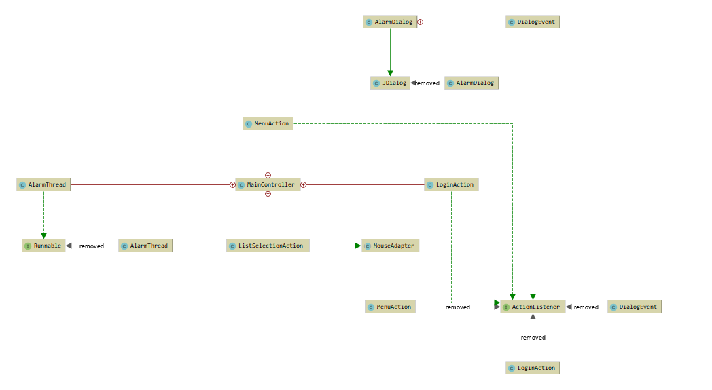

# SocketProject
> Personal Alarm System

# Alarm Service
## 프로젝트 개요
### 문제점
- 매번 프로그램을 다운로드 받아서 자신의 알람을 재 설정해야되는 문제점 존재
- 컴퓨터가 에러가 나거나, 데이터의 소실이 있는 경우 찾을 수 없는 경우 존재 
### 해결방안
- 로그인을 통한 서버 / 클라이언트 기반의 프로그램 개발
- 클라이언트 프로그램은 개별적으로 동작이 가능한 프로그램 개발
### Issue
#### 클라이언트
- 클라이언트 UI 구현 ( Finish )
- 클라이언트 System 종료 구현 ( Finish )
- 클라이언트 타이머 계산 쓰레드 구현 ( Finish )
- 클라이언트 음악 프로그램 재생 구현
- 클라이언트 컨트롤러에서 자동으로 시간 되면 시스템 종료 ( Finish )
- 클라이언트 로그인 시스템 구성
- 클라이언트 정보 송수신 처리
- 클라이언트 프로그램 음악 설정시 서버에 전송
- 클라이언트 프로그램 알람 설정 정보 저장 파일 형식 지정
#### 서버
- 클라이언트 회원가입 처리
- 클라이언트 로그인 처리
- 클라이언트의 데이터 전송 처리
- 클라이언트의 음악파일 전송 처리 ( 자동 )
- Socket or HTTP 통신 규약 설정

### UML Class Diagram

